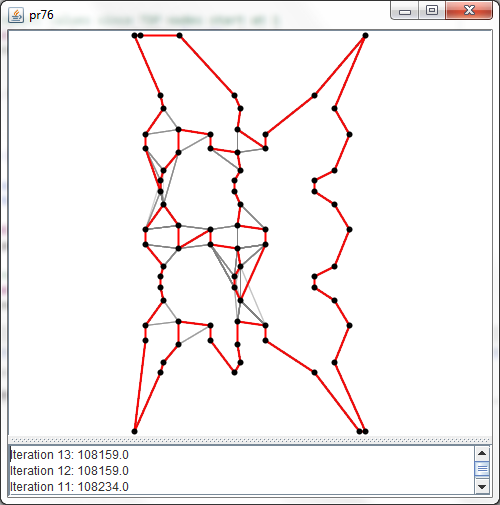

A Java library for TSPLIB
===

### About TSPLIB4J:

[TSPLIB](http://comopt.ifi.uni-heidelberg.de/software/TSPLIB95/) is a collection
of [traveling salesman](http://en.wikipedia.org/wiki/Travelling_salesman_problem),
[vehicle routing](http://en.wikipedia.org/wiki/Vehicle_routing_problem), and
[Hamiltonian cycle](http://en.wikipedia.org/wiki/Hamiltonian_path_problem)
problem instances and a file format for storing instance data.  TSPLIB4J is a
Java library for reading and processing TSPLIB instance data.  TSPLIB4J is
licensed under the MIT license.

### Prerequisites

  - Java 1.5 or later
  - [JUnit 4](http://www.junit.org/) to run test cases
  - [MOEA Framework](http://www.moeaframework.org/) JAR files to run TSPExample
  
### Setup

Unix/Linux users can run the `download-datasets.sh` bash script to download and
setup the TSPLIB problem instances.

For Windows users, first create a `data/` directory and the subfolders listed
below.  Next, download any or all of the
[TSPLIB problem instances](http://comopt.ifi.uni-heidelberg.de/software/TSPLIB95/).
Finally, extract the problem instances into the appropriate folder.

    data/atsp
    data/hcp
    data/sop
    data/tsp
    data/vrp

### Traveling Salesman Problem:

    TSPProblem problem = new TSPProblem(new File("./data/tsp/pcb442.tsp"));
    problem.addTour(new File("./data/tsp/pcb442.opt.tour"));
    		
    for (Tour tour : problem.getTours()) {
    	System.out.println(tour.distance(problem));
    }
    
### Hamiltonian Cycle Problem:

    TSPProblem problem = new TSPProblem(new File("./data/hcp/alb1000.hcp"));
    problem.addTour(new File("./data/hcp/alb1000.opt.tour"));
    
    for (Tour tour : problem.getTours()) {
    	System.out.println(tour.isHamiltonianCycle(problem));
    }
    
### Displaying Solutions

    TSPProblem problem = new TSPProblem(new File("./data/tsp/gr120.tsp"));
    problem.addTour(new File("./data/tsp/gr120.opt.tour"));
    
    TSPPanel panel = new TSPPanel(problem);
    panel.displayTour(problem.getTours().get(0), Color.RED);
		
    JFrame frame = new JFrame(problem.getName());
    frame.getContentPane().setLayout(new BorderLayout());
    frame.getContentPane().add(panel, BorderLayout.CENTER);
    frame.setDefaultCloseOperation(JFrame.DISPOSE_ON_CLOSE);
    frame.setSize(500, 400);
    frame.setLocationRelativeTo(null);
    frame.setVisible(true);
    
### Optimization Example

The `TSPExample.java` file provides an example of optimizing a traveling
salesman problem using the [MOEA Framework](http://www.moeaframework.org)
library.  To run this example, you must first download the [compiled binaries
for the MOEA Framework](http://www.moeaframework.org/downloads.html).  Next,
you'll need to include the `.jar` files in the `lib/` directory when compiling
and running the TSPLIB4J code.  Finally, run TSPExample.  TSPExample creates a
GUI showing the evolution of the optimal solution from the initial random
population to the final optimal solution discovered by a genetic algorithm.
The current example solves the `data/tsp/pr76.tsp` problem instance.

-><-

Other Open Source Libraries
---
  - [MOEA Framework](http://www.moeaframework.org) - A Free and Open Source Java Framework for Multiobjective Optimization
  - [DGantt](http://sourceforge.net/projects/dgantt/) - A simple yet powerful Gantt chart library for Java 1.6 and later
